## E-COMMERCE MICROSERVICE PROJECT FOR DEVOPS

### PROJECT OVERVIEW

  In this project we would demostarate the deployment and management of a cloud-native in e-commerce microservice platform using Kubernates,Docker,AWS-Ecr,GitHub Actions, ArgoCD, Prometheus, Grafana, Elasticsearch, Fluentd, and Kibana. 

  The project includes:

   - Microservices architecture
   -  Kubernetes orchestration
   -  CI/CD with GitHub Actions
   - Containerization with Docker
   -  Image storage with AWS ECR
   - GitOps using ArgoCD and ApplicationSet
   - Ingress-based routing
   - Monitoring using Prometheus and Grafana
   - Logging using Elasticsearch, Fluentd, and Kibana (EFK stack)


 ### Technologies Used
 - Docker
 - Git Action
 - CI/CD
 - AWS ECR
 - KUBERNATES
 - ArgoCD
 - Applicationset
 - Grafana
 - Nginx ingress
 - Elasticsearch
 - Prometheus
 - Kibana
 - Fluentd

### **MICROSERVICE IMPLEMENTATION**:
 
 Create a file for the each of the microservices:
- Product
- Order
- Cart

Inside each of the microservices:
RUN:


```
npm init -y
npm install express
touch index.js
```
Product/index.js
```
const express = require("express");
const app = express();

app.get("/products", (req, res) => {
  res.json([
    { id: 1, name: "Laptop" },
    { id: 2, name: "Phone" }
  ]);
});

app.listen(3001, () => console.log("Product service running"));
```

Cart/index.js
```
const express = require("express");
const app = express();

app.use(express.json());

let cart = [];

app.post("/cart", (req, res) => {
  cart.push(req.body);
  res.json(cart);
});

app.get("/cart", (req, res) => res.json(cart));

app.listen(3002, () => console.log("Cart service running"));
```

Order/index.js

```
 const express = require("express");
const app = express();

let orders = [];

app.post("/orders", (req, res) => {
  orders.push({ id: orders.length + 1 });
  res.json(orders);
});

app.get("/orders", (req, res) => res.json(orders));

app.listen(3003, () => console.log("Order service running"));
```
**Create ECR Repositories**
```
aws ecr create-repository --repository-name product-service --region us-east-1
aws ecr create-repository --repository-name cart-service --region us-east-1
aws ecr create-repository --repository-name order-service --region us-east-1
```
### **Dockerization**

Each microservice has its dockerfile

```
FROM node:18

WORKDIR /app

COPY package*.json ./

RUN npm install

COPY . .

EXPOSE 3001

CMD ["node", "index.js"]
```

Change ports:

- cart → 3002

- order → 3003

Change ports:

**Build & Run Locally**

From each service folder:

```
docker build -t product-service .
docker tag product-service:latest 707913648704.dkr.ecr.us-east-1.amazonaws.com/product-service:latest

```
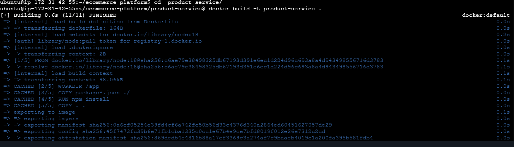

Do same for other microservices
**Test Locally**
 - Get Your Commit SHA
  
  ```
  git rev-parse --short HEAD
  ```
   Save output

   ```
   COMMIT_SHA=$(git rev-parse --short HEAD)
echo $COMMIT_SHA
```

**Push to ECR**

```
docker push 707913648704.dkr.ecr.us-east-1.amazonaws.com/product-service:latest
docker push 707913648704.dkr.ecr.us-east-1.amazonaws.com/cart-service:latest
docker push 707913648704.dkr.ecr.us-east-1.amazonaws.com/order-service:latest
```
**Run Container Locally**
```
docker run -p 3003:3003product-service:$COMMIT_SHA
```

**Test on Browser**

```
http://3.91.225.8:3003/product
```
  **Kubernetes Deployment**

  - Create a folder k8s
  ```
  mkdir k8s
  ```
  Inside the folder create a manifest for each microservice

  **Product-deployment.yaml**

  ```
  apiVersion: apps/v1
kind: Deployment
metadata:
  name: product-service
spec:
  replicas: 2
  selector:
    matchLabels:
      app: product-service
  template:
    metadata:
      labels:
        app: product-service
    spec:
      containers:
        - name: product-service
          image: 707913648704.dkr.ecr.us-east-1.amazonaws.com/product-service:latest
          ports:
            - containerPort: 3003
```

**Product-service.yaml**
```
apiVersion: v1
kind: Service
metadata:
  name: product-service
spec:
  type: ClusterIP
  selector:
    app: product-service
  ports:
    - port: 80
      targetPort: 3003

 ```     
Do same to other microservice

**Tag and Push Image**

```
COMMIT_SHA=$(git rev-parse --short HEAD)

docker build -t product-service:$COMMIT_SHA .
docker tag product-service:$COMMIT_SHA 707913648704.dkr.ecr.us-east-1.amazonaws.com/product-service:$COMMIT_SHA
docker push 707913648704.dkr.ecr.us-east-1.amazonaws.com/product-service:$COMMIT_SHA
```
**Apply Github/workflows**

**Create a file for github-workflows**
```
nano github/workflows/deploy.yaml
```
```
name: Build and Deploy to ECR (GitOps)

on: push

env:
  AWS_REGION: us-east-1
  ECR_REGISTRY: "707913648704.dkr.ecr.us-east-1.amazonaws.com"

permissions:
  contents: write  

jobs:
  build-and-push:
    runs-on: ubuntu-latest

    steps:
      - name: Checkout code
        uses: actions/checkout@v3

      - name: Set commit SHA
        run: echo "COMMIT_SHA=$(git rev-parse --short HEAD)" >> $GITHUB_ENV

      - name: Configure AWS credentials
        uses: aws-actions/configure-aws-credentials@v2
        with:
         aws-access-key-id: ${{ secrets.AWS_ACCESS_KEY_ID }}
         aws-secret-access-key: ${{ secrets.AWS_SECRET_ACCESS_KEY }}
         aws-region: us-east-1

      - name: Login to ECR
        uses: aws-actions/amazon-ecr-login@v1

      # ---------------------------
      # BUILD & PUSH IMAGES
      # ---------------------------

      - name: Build & Push Product Service
        run: |
          docker build -t product-service:${COMMIT_SHA} ./product-service
          docker tag product-service:${COMMIT_SHA} $ECR_REGISTRY/product-service:${COMMIT_SHA}
          docker push $ECR_REGISTRY/product-service:${COMMIT_SHA}

      - name: Build & Push Cart Service
        run: |
          docker build -t cart-service:${COMMIT_SHA} ./cart-service
          docker tag cart-service:${COMMIT_SHA} $ECR_REGISTRY/cart-service:${COMMIT_SHA}
          docker push $ECR_REGISTRY/cart-service:${COMMIT_SHA}

      - name: Build & Push Order Service
        run: |
          docker build -t order-service:${COMMIT_SHA} ./order-service
          docker tag order-service:${COMMIT_SHA} $ECR_REGISTRY/order-service:${COMMIT_SHA}
          docker push $ECR_REGISTRY/order-service:${COMMIT_SHA}

      # ---------------------------
      # UPDATE K8s MANIFESTS
      # ---------------------------

      - name: Update Kubernetes manifests
        run: |
          sed -i "s|product-service:.*|product-service:${COMMIT_SHA}|g" k8s/product-deployment.yaml
          sed -i "s|cart-service:.*|cart-service:${COMMIT_SHA}|g" k8s/cart-deployment.yaml
          sed -i "s|order-service:.*|order-service:${COMMIT_SHA}|g" k8s/order-deployment.yaml

      - name: Commit and push changes
        run: |
          git config user.name "github-actions"
          git config user.email "actions@github.com"
          git add k8s/
          git commit -m "Update images to ${COMMIT_SHA}" || echo "No changes"
          git push

```


**API Gateway**

nginx-config
```
events {}

http {
  server {
    listen 80;

    location /products {
      proxy_pass http://product-service;
    }

    location /cart {
      proxy_pass http://cart-service;
    }

    location /orders {
      proxy_pass http://order-service;
    }
  }
}
```
After which everything is push to the github

Error i had when i applied kubernates my kubernates has an invalid spec project 

**Before correction**

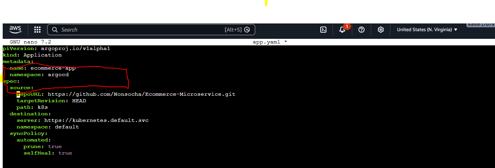

**After the correction**
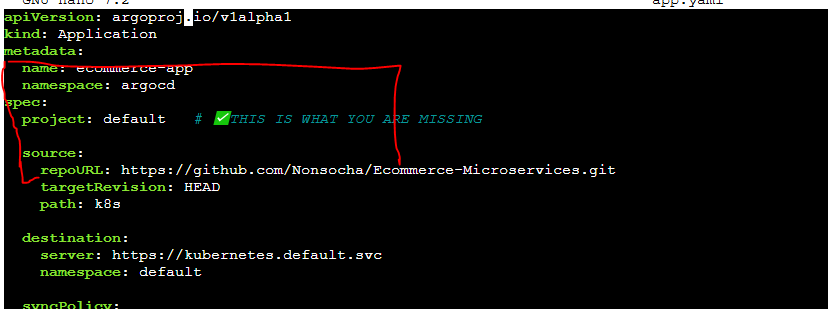

```
apiVersion: argoproj.io/v1alpha1
kind: Application
metadata:
  name: ecommerce-app
  namespace: argocd
spec:
  project: default   

  source:
    repoURL: https://github.com/Nonsocha/Ecommerce-Microservices.git
    targetRevision: HEAD
    path: k8s

  destination:
    server: https://kubernetes.default.svc
    namespace: default

  syncPolicy:
    automated:
      prune: true
      selfHeal: true
 ```

 **Apply**
 ```
 kubectl apply -f app.yaml     
 ```

 **Check Argocd**
 ```
 kubectl get applications -n argocd
 ```
 **Push to Gitub**
```
git add .
git commit -m "add k8s manifests"
git push
``` 

### SETUP:
```
kubectl create namespace argocd

kubectl apply -n argocd -f https://raw.githubusercontent.com/argoproj/argo-cd/stable/manifests/install.yaml
```

**Verify**

```
kubectl get pods -n argocd
```
### API GATEWAY (ingress)

Install  NGINX ingress

```
kubectl apply -f https://raw.githubusercontent.com/kubernetes/ingress-nginx/main/deploy/static/provider/cloud/deploy.yaml
```
**Wait for**
```
kubectl get pods -n ingress-nginx
```
**Get External IP**
```
kubectl get svc -n ingress-nginx
```

nano k8s/ingress.yaml
```
apiVersion: networking.k8s.io/v1
kind: Ingress
metadata:
name: ecommerce-ingress
annotations:
nginx.ingress.kubernetes.io/rewrite-target: /
spec:
ingressClassName: nginx
rules:
- http:
paths:
- path: /products
pathType: Prefix
backend:
service:
name: product-service
port:
number: 3001
      - path: /cart
        pathType: Prefix
        backend:
          service:
            name: cart-service
            port:
              number: 3002

      - path: /orders
        pathType: Prefix
        backend:
          service:
            name: order-service
            port:
              number: 3003
```

**Apply Ingress**
```
kubectl apply -f k8s/ingress.yaml
```

**Verify**
```
kubectl get ingress
```

**Test in Browser**
```
http://a59c6619096da40bbb82b179e54d0c90-2117373083.us-east-1.elb.amazonaws.com/products
```                

Tried to test on browser,i got an error 
```
503 Service Temporarily Unavailable

```
Meaning  Ingress is reachable, but it can’t successfully route to your backend service.
which was cause my a mismatch in my targetport number.Application was not listening well also.

Before
```
app.listen(3003)
```
Fix
- verified endpoint
```

app.listen(3003, "0.0.0.0", () =>
  console.log("Product service running")
);
```
- verified services
- verified ingress rules
- verified application ports

Remove rewrite annotation (if present)

```
kubectl edit ingress ecommerce-ingress
```

**Delete**

```
nginx.ingress.kubernetes.io/rewrite-target: /
```

```
kubectl get ingress
kubectl describe ingress ecommerce-ingress
kubectl get svc
kubectl get endpoints
```

```
docker build -t product-service:<new-tag> .
docker push <ECR>/product-service:<new-tag>
```
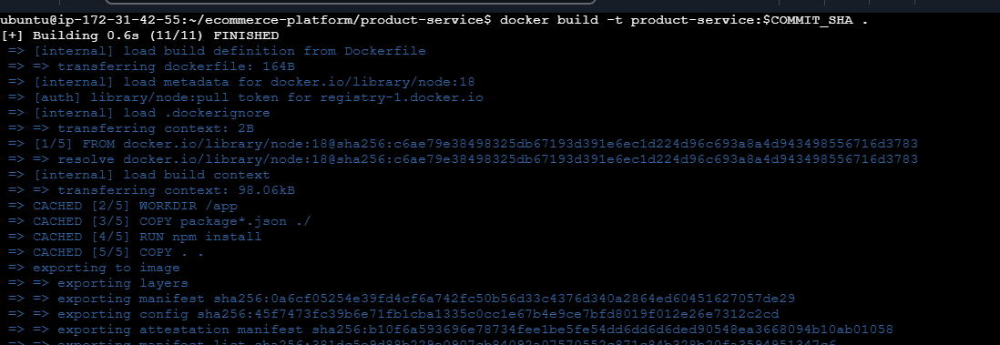

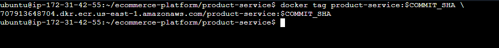

Test Again

**Error order**:
returns 502

**Cause**

Port mismatch between:

- application
- deployment
- service
- ingress

**Fix**

Aligned ports

Reapply

```
kubectl apply -f k8s/ingress.yaml
```

Restart Nginx controller

```
kubectl rollout restart deployment ingress-nginx-controller -n ingress-nginx
```

**Integrate AWS ECR Using Github Action**

### GitHub Actions CI/CD Pipeline
**Workflow Responsibilities**

- Build Docker images
- Push images to ECR
- Update Kubernetes manifests
Commit updated manifests
- Push changes to GitHub

**Error**  
GitHub Push Permission Denied

```
permission denied to github actions[bot]
```
The cause was because github token lacked write permission

**Fix**
Add workflow Permission

```
permissions:
   content:write
```

### Prometheus and Grafana Monitoring

**Add Helm**
```
curl https://raw.githubusercontent.com/helm/helm/main/scripts/get-helm-3 | bash
```

### Prometheus Stack Installation
```
helm install monitoring prometheus-community/kube-prometheus-stack \
  --namespace monitoring \
  --create-namespace
 ```

### Access Grafana
   Best Practice for production.Expose Gafana Using LoadBalancer.
   Firstly,change the type from Cluster IP to LoadBalancer.
   
   **Run**
 ```
  kubectl edit svc monitoring-grafana -n monitoring
 ```

 **Then Run**
  ```
  kubectl get svc -n monitoring
  ```

  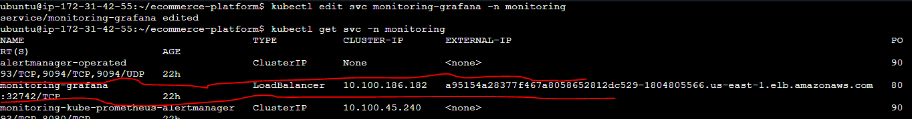

 
 And your external Grafana URL is:

 ```
 a95154a28377f467a8058652812dc529-1804805566.us-east-1.elb.amazonaws.com
 ```
 
 Get Password:

 ```
  kubectl get secret -n monitoring monitoring-grafana \
-o jsonpath="{.data.admin-password}" | base64 --decode
```


**Monitor Your Microservices**

To monitor your Node.js apps properly, add Prometheus metrics.

Install:

```
npm install prom client
```
**Update  Product-service/index.js**

```
const express = require("express");
const client = require("prom-client");

const app = express();

client.collectDefaultMetrics();

app.get("/metrics", async (req, res) => {
  res.set("Content-Type", client.register.contentType);
  res.end(await client.register.metrics());
});

app.get("/products", (req, res) => {
  res.json([
    { id: 1, name: "Laptop" },
    { id: 2, name: "Phone" }
  ]);
});

app.listen(3003, "0.0.0.0", () => {
  console.log("Product service running");
});
```
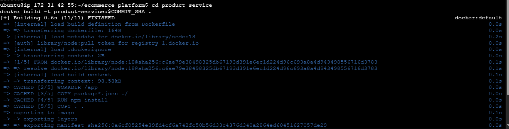

**Tag and Push to Ecr**

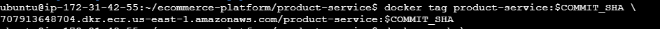

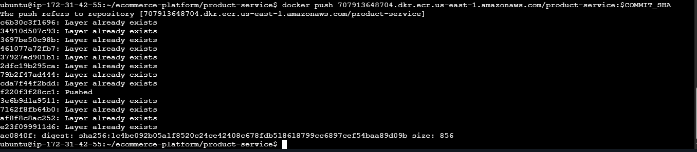

**Restart Deployment**

```
kubectl rollout restart deployment product-service
```
In another terminal:

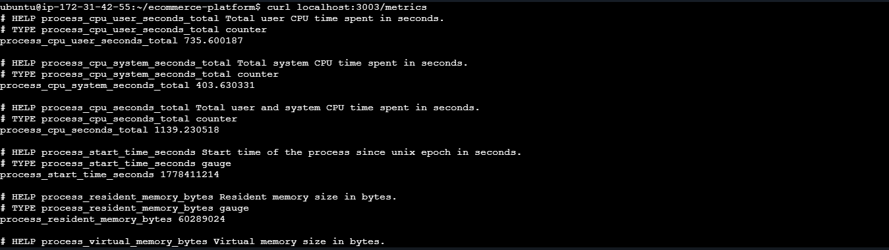

To display on Browser ,Change service port from Cluster IP to LoadBalancer

Run:
```
kubectl get svc
```
You’ll get an AWS ELB address.

Then test:

```
http://http://aa5438231e566482da3b949cc794bed8-1356170171.us-east-1.elb.amazonaws.com/products
```

  Do same for
  - order-service
  - cart-service

### CREATE A MONITORSERVICE

For each microservice create a monitorservice so prometheus automatically collect metrics

nano k8s/product-servic-monitor

```
apiVersion: monitoring.coreos.com/v1
kind: ServiceMonitor
metadata:
  name: product-service-monitor
  labels:
    release: monitoring
spec:
  selector:
    matchLabels:
      app: product-service
  endpoints:
  - port: http
    path: /metrics
    interval: 15s
```
**Apply**

```
kubectl apply -f k8s/product-servicemonitor.yaml
```

**Verify**

```
kubectl get servicemonitors
```


### SETUP LOGGING USING ELASTICSEARCH,FLUENTD AND KIBANA


- Fluentd collects pod logs
- Elasticsearch stores logs
- Kibana visualizes/searches logs


**Create Logging Namespace**

```
kubectl create namespace logging
```

nano elasticsearch.yaml
```
apiVersion: apps/v1
kind: Deployment
metadata:
  name: elasticsearch
  namespace: logging
spec:
  replicas: 1
  selector:
    matchLabels:
      app: elasticsearch
  template:
    metadata:
      labels:
        app: elasticsearch
    spec:
      containers:
      - name: elasticsearch
        image: docker.elastic.co/elasticsearch/elasticsearch:7.17.10
        env:
        - name: discovery.type
          value: single-node
        ports:
        - containerPort: 9200
---
apiVersion: v1
kind: Service
metadata:
  name: elasticsearch
  namespace: logging
spec:
  selector:
    app: elasticsearch
  ports:
  - port: 9200
    targetPort: 9200
 ```

  **Apply**
  ```
  kubectl apply -f elasticsearch.yaml
  ```

  
  ## Install Kibana

  Create:
```
kibana.yaml
```

nano kibana.yaml

```
apiVersion: apps/v1
kind: Deployment
metadata:
  name: kibana
  namespace: logging
spec:
  replicas: 1
  selector:
    matchLabels:
      app: kibana
  template:
    metadata:
      labels:
        app: kibana
    spec:
      containers:
      - name: kibana
        image: docker.elastic.co/kibana/kibana:7.17.10
        env:
        - name: ELASTICSEARCH_HOSTS
          value: http://elasticsearch:9200
        ports:
        - containerPort: 5601
---
apiVersion: v1
kind: Service
metadata:
  name: kibana
  namespace: logging
spec:
  type: LoadBalancer
  selector:
    app: kibana
  ports:
  - port: 5601
    targetPort: 5601
  ```
  **Apply**
  ```
  kubectl apply -f kibana.yaml
  ```  
  **Kibana Access**

  ```
  http://3.91.225.8:5601
  ```
  After i ran the above in my browser it was not reachable.
      
  **Fix**
  - Checked if kibana is running
  ```
  kubectl get pods -A
  ```
  - Checked if the service exit
  ```
  kubectl get svc -A
  ```

  - Check sevice name
  ```
  kubectl get svc -n logging
  ```

  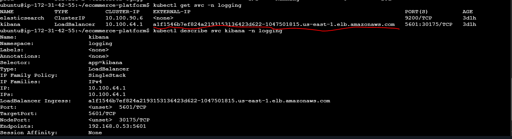

  ##   Install Fluentd

  Create a file 
   
   nano fluentd-config.yaml

   ```
   apiVersion: v1
kind: ConfigMap
metadata:
  name: fluentd-config
  namespace: logging

data:
  fluent.conf: |
    <source>
      @type tail
      path /var/log/containers/*.log
      pos_file /var/log/fluentd-containers.log.pos
      tag kubernetes.*
      read_from_head true
      <parse>
        @type json
      </parse>
    </source>

    <match kubernetes.**>
      @type elasticsearch
      host elasticsearch.logging.svc.cluster.local
      port 9200
      logstash_format true
      logstash_prefix kubernetes
      include_tag_key true
      type_name fluentd
      flush_interval 5s
    </match>
  ``` 
 **Apply**

 ```
 kubectl apply -f fluentd-config.yaml
```

**Verify pods**
```
kubectl get pods -n logging
```

**Create Fluentd-daemon File**
nano fluentd-daemon.yaml

```
apiVersion: apps/v1
kind: DaemonSet
metadata:
  name: fluentd
  namespace: logging

spec:
  selector:
    matchLabels:
      app: fluentd

  template:
    metadata:
      labels:
        app: fluentd

    spec:
      containers:
      - name: fluentd
        image: fluent/fluentd-kubernetes-daemonset:v1-debian-elasticsearch

        volumeMounts:
        - name: varlog
          mountPath: /var/log

        - name: config-volume
          mountPath: /fluentd/etc/

      volumes:
      - name: varlog
        hostPath:
          path: /var/log

      - name: config-volume
        configMap:
          name: fluentd-config
 ```

 **Apply**
 ```
 kubectl apply -f fluentd-daemonset.yaml
 ```         
**Verify Elasticsearch Receives Logs**

```
kubectl exec -it -n logging deployment/elasticsearch -- \
curl localhost:9200/_cat/indices?v
```

**Error**
pattern not matched

**Cause**

Wrong parser type.

**Incorrect**
```
@type json
```
**Correct**
```
@type none
```

### **Elasticsearch Verification**

**Check indices**
```
kubectl exec -it -n logging deployment/elasticsearch -- \
curl localhost:9200/_cat/indices?v
```

### **Fluentd Verification**

**Logs**
```
kubectl logs -n logging -l app=fluentd
```


### **Key Troubleshooting Skills Developed**
**Kubernetes**
- Pod debugging
- Service troubleshooting
- Endpoint verification
- Ingress troubleshooting
- Port mismatch debugging
- CrashLoopBackOff analysis

### **Docker**
- Image build
- Image tagging
- ECR authentication
- Container debugging

### **CI/CD**
- GitHub Actions debugging
- Git permissions troubleshooting
- Workflow correction
- Environment variables handling

### **Monitoring and Logging**

- Prometheus metrics exposure
- Grafana setup
- Fluentd parsing fixes
- Elasticsearch verification
- Kibana visualization